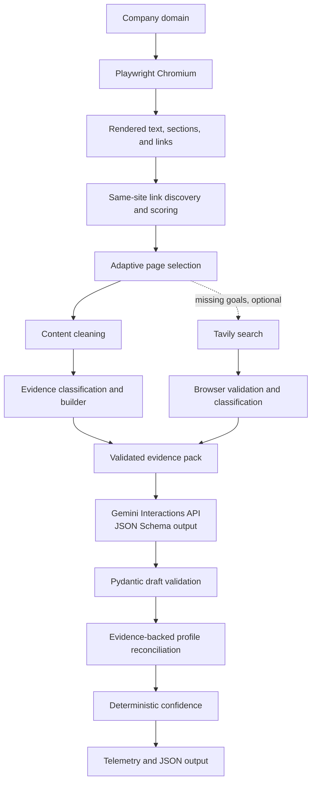

# Evidence-First Autonomous Lead Intelligence Agent

Evidence-First Autonomous Lead Intelligence Agent enriches a list of company domains into source-backed lead profiles. Given a domain, it renders the public site in Chromium, selects a small set of same-site pages that can close information gaps, turns selected content into a compact evidence pack, and asks Gemini for a schema-constrained profile. The result is JSON containing company context, target audience, public role-based inboxes, leadership where supported, cited evidence, a deterministic confidence score, and per-run telemetry. The evidence-first design matters because a company website contains navigation, forms, customer stories, and other text that should not automatically become a claim about the company.

## Problem

Modern company sites are rarely clean data sources. They are JavaScript-rendered and combine product copy with navigation, pricing, contact forms, testimonials, customer case studies, and repeated footer text. Passing that material wholesale to an LLM risks unsupported company summaries, incorrect leadership attribution, and unnecessary token use.

This project separates retrieval, evidence selection, structured extraction, and final validation. The LLM receives a curated evidence pack rather than raw HTML, and the final profile is reconciled against that pack before it is returned.

## What the agent does

For each domain, the agent:

1. Renders the homepage with Playwright Chromium and captures visible body text, headings, rendered links, status, title, and final URL.
2. Normalizes same-site links, scores them, and explores pages adaptively within a configurable page budget.
3. Cleans rendered text and sections to reduce repeated navigation and UI boilerplate. It also preserves role-based `mailto:` addresses that may be hidden behind a contact button.
4. Classifies candidate material for company overview, target audience, public generic contact information, and leadership; then creates a compact evidence pack with source URLs and evidence strengths.
5. Optionally searches for evidence gaps through Tavily. Search results are rendered and classified in the browser before they can enter the evidence pack; snippets alone are not evidence.
6. Sends the evidence pack to Gemini through the Interactions API with a JSON Schema derived from Pydantic models.
7. Reconciles the structured Gemini draft against the validated evidence, calculates deterministic confidence, attaches usage telemetry, and returns a per-domain result.

Domains are processed independently. A browser, search, or Gemini failure for one domain is returned as a structured failure without stopping later domains.

## Why evidence-first

The LLM does not receive raw HTML and is not treated as the source of truth. It receives only evidence selected from rendered, cleaned page content. The final profile is then constrained by that evidence again during profile assembly.

Implemented safeguards include:

- Customer-story, case-study, testimonial, and review URL paths are not accepted as company-overview evidence.
- Customer quote patterns and sales/form-only text, such as a generic "How can we help you?" prompt, are excluded from overview evidence.
- Content cleaning removes repeated short lines and common standalone navigation fragments before classification.
- Leadership needs a named person and a leadership role; a team heading or a LinkedIn anchor by itself cannot create leadership evidence.
- Generic email collection is limited to role-based local parts such as `info`, `sales`, `support`, `contact`, `press`, `security`, and `privacy`; personal addresses are excluded.
- Tavily snippets are never supplied directly to Gemini. Candidate URLs must be fetched, classified, and accepted by the same evidence pipeline.
- Unsupported fields are empty. If Gemini supplies a field with no valid evidence, final profile reconciliation clears it; if Gemini leaves an evidence-backed text field empty, the strongest valid evidence value is used instead.
- Confidence is calculated in code from evidence-backed populated fields, not generated by Gemini.

## Target information extracted

The final `LeadProfile` contains the following fields.

| Field | Meaning |
| --- | --- |
| `company_domain` | The processed domain/URL. |
| `company_overview` | Evidence-backed company description. |
| `icp` | Explicit target-audience or ideal-customer information. |
| `generic_emails` | Public role-based email addresses supported by page content or `mailto:` links. |
| `leadership` | Supported leadership names, roles, and a LinkedIn URL only when that URL appears in evidence. |
| `evidence` | The evidence items used, including field, value, source URL, source type, and strength. |
| `confidence` | Deterministic `0.0`-`1.0` evidence-quality score. |
| `telemetry` | Gemini model/provider, call count, available token counts, configured estimated cost, and errors. |

An empty field is meaningful: the available validated evidence did not support that claim.

## Autonomous and adaptive behavior

This is not a fixed list-of-URLs scraper. `LinkDiscovery` keeps same-site HTTP(S) links, removes fragments and query strings, deduplicates them, and uses `LinkScorer` for basic page relevance. `InformationPlanner` evaluates each remaining link against unresolved goals using link text and path keywords, with per-goal priorities.

`SiteAnalyzer` repeatedly chooses the best candidate for the current evidence gaps. Its adaptive score combines goal priority, link relevance, base link score, and a penalty for repeated attempts at the same goal. It stops when all required goals have usable evidence, no useful candidate remains, or `max_pages` is reached. A goal is complete only when `EvidenceBuilder` produces a non-empty item for it; a heading or navigation label alone is insufficient.

When a Tavily key is configured, `FallbackController` queries only still-missing goals. The agent validates up to two results per goal in the browser and permits external sources only for validated LinkedIn leadership pages.

## Architecture



## Technology stack

| Technology | Role in this repository |
| --- | --- |
| Python | Application, orchestration, schemas, and tests. |
| Playwright / Chromium | JavaScript-capable browser rendering and DOM extraction. |
| Google Gemini | Gemini Interactions API structured extraction using `gemini-3.6-flash`. |
| Pydantic | JSON Schema generation and profile/telemetry validation. |
| Tavily | Optional search fallback for unresolved evidence goals. |
| python-dotenv | Local environment-variable loading. |
| pytest | Offline unit and integration-boundary tests. |

## Output

`main.py` writes a JSON payload with a result per input domain and an aggregate telemetry summary. The following is a concise excerpt from the stored `postman.com` result:

```json
{
  "results": [
    {
      "domain": "https://postman.com",
      "success": true,
      "error": null,
      "pages_discovered": 75,
      "pages_selected": 2,
      "completed_goals": ["company_overview", "contact_information", "leadership", "target_audience"],
      "missing_goals": [],
      "evidence_items": 5,
      "profile": {
        "company_domain": "https://postman.com",
        "company_overview": "Postman is an API platform for building and using APIs. Postman simplifies each step of the API lifecycle and streamlines collaboration so you can create better APIs\u2014faster.",
        "icp": "Develop, test, manage, and distribute APIs and services. Built for engineers. Designed for enterprise scale.",
        "generic_emails": ["info@postman.com"],
        "leadership": [],
        "evidence": [
          {
            "field": "target_audience",
            "value": "Develop, test, manage, and distribute APIs and services. Built for engineers. Designed for enterprise scale.",
            "source_url": "https://www.postman.com/",
            "source_type": "company_website",
            "strength": "strong"
          }
        ],
        "confidence": 0.76,
        "telemetry": {
          "provider": "gemini",
          "model": "gemini-3.6-flash",
          "llm_calls": 1,
          "input_tokens": 741,
          "output_tokens": 199,
          "thought_tokens": 1514,
          "total_tokens": 2454,
          "estimated_cost_usd": 0.0,
          "errors": []
        }
      }
    }
  ],
  "telemetry_summary": {
    "provider": "gemini",
    "model": "gemini-3.6-flash",
    "llm_calls": 3,
    "input_tokens": 1259,
    "output_tokens": 785,
    "thought_tokens": 4500,
    "total_tokens": 6544,
    "estimated_cost_usd": 0.0,
    "errors": []
  }
}
```

The excerpt omits additional evidence items from the stored record. Evidence values are non-empty because they are created only from usable evidence. Evidence strength is `strong` or `medium` for items included by the builder; confidence combines supported populated fields, evidence strength, first-party coverage, corroboration, and whether leadership has a LinkedIn URL. `estimated_cost_usd` is an estimate only: it remains `0.0` until verified per-million-token rates are configured.

## Included sample and validation

[`outputs/lead_profiles.json`](outputs/lead_profiles.json) is a preserved live sample for the three included domains:

- `postman.com`
- `supabase.com`
- `vapi.ai`

## Resilience and failure handling

`BrowserCollector` returns structured failures for invalid URLs, navigation timeouts, browser startup errors, HTTP status failures, and common blocker text such as access-denied or CAPTCHA prompts. Missing DOM elements fall back to empty text, sections, or links rather than raising a scraping exception.

At the orchestration boundary, `LeadEnrichmentAgent.enrich_domain()` catches failures per domain. Gemini extraction distinguishes unavailable configuration, invalid structured output, quota exhaustion, and retryable transient failures. Retry attempts are bounded; quota exhaustion is reported rather than retried indefinitely. Optional search failures are ignored so that first-party collection can still produce a profile.

## Confidence and telemetry

Confidence is deterministic. The engine assigns base weights to evidence-backed populated overview, ICP, generic-email, and leadership fields. It applies evidence-strength multipliers, reduces leadership quality when no LinkedIn URL is present, adds a small bonus when all supported fields have first-party evidence, and adds a bounded corroboration bonus for fields supported by multiple source URLs. The result is clamped to `0.0`-`1.0`.

Telemetry records provider, model, successful LLM-call count, input/output/thought/total token counts when exposed by the Gemini SDK, estimated cost, and extraction errors. Cost estimation uses these optional `.env` variables, expressed as USD per 1,000,000 tokens:

- `GEMINI_INPUT_USD_PER_1M_TOKENS`
- `GEMINI_OUTPUT_USD_PER_1M_TOKENS`
- `GEMINI_THOUGHT_USD_PER_1M_TOKENS`

Without configured rates, the project reports `0.0` rather than guessing a billed cost.

## Setup

Python 3.11+ is recommended. The commands below assume a Windows virtual environment at `.venv`.

```powershell
.\.venv\Scripts\python.exe -m pip install -r requirements.txt
.\.venv\Scripts\playwright.exe install chromium
Copy-Item .env.example .env
```

Set the required Gemini Developer API credential in `.env`:

```dotenv
GEMINI_API_KEY=
```

`GEMINI_MODEL` defaults to `gemini-3.6-flash`. `TAVILY_API_KEY` is optional and enables the validated search fallback. `MAX_PAGES` controls the default exploration budget. Do not commit `.env`.

## Running

Run the three default domains configured in `main.py` and write to `outputs/lead_profiles.json`:

```powershell
.\.venv\Scripts\python.exe main.py
```

Supply domains explicitly and set a page budget:

```powershell
.\.venv\Scripts\python.exe main.py postman.com supabase.com vapi.ai --max-pages 5
```

Other supported CLI options are `--headed`, which shows Chromium, and `--output`, which selects the JSON file path.

For a direct live smoke run that prints each profile/result and aggregate telemetry without writing the CLI output file:

```powershell
.\.venv\Scripts\python.exe scripts\run_live.py
```

Live runs require Chromium, network access, a valid Gemini key with available quota, and a Tavily key only when search fallback is desired.

## Testing

The normal test suite uses fake browser, search, and Gemini boundaries. It does not require API keys or network access.

```powershell
.\.venv\Scripts\python.exe -m pytest -q
```

## Project structure

```text
.
|-- main.py                         # CLI and JSON-file output
|-- requirements.txt
|-- pyproject.toml                  # pytest configuration
|-- .env.example
|-- outputs/
|   `-- lead_profiles.json          # included three-domain sample
|-- scripts/
|   `-- run_live.py                 # direct live smoke runner
|-- src/
|   |-- agent.py                    # per-domain orchestration
|   |-- browser.py                  # Playwright rendering and failures
|   |-- site_analyzer.py            # adaptive first-party exploration
|   |-- link_discovery.py           # same-site link normalization
|   |-- link_scorer.py              # link keyword scoring
|   |-- planner.py                  # gap-aware link planning
|   |-- goal_tracker.py             # evidence-backed missing goals
|   |-- content_cleaner.py          # visible-text cleanup
|   |-- evidence_collector.py       # cleaned page collection and mailto capture
|   |-- evidence_classifier.py      # conservative evidence signals
|   |-- evidence_builder.py         # compact evidence-pack creation
|   |-- evidence_pack.py            # evidence data structures and formatting
|   |-- llm.py                      # abstract LLM extractor contract
|   |-- gemini_extractor.py         # Gemini schema-constrained extraction
|   |-- profile_builder.py          # evidence-backed final reconciliation
|   |-- confidence.py               # deterministic confidence scoring
|   |-- telemetry.py                # token and cost tracking
|   |-- models.py                   # Pydantic profile contracts
|   |-- search.py                   # search interfaces
|   |-- search_fallback.py          # gap-specific search queries
|   |-- tavily_search.py            # Tavily provider
|   `-- fallback_controller.py      # missing-goal fallback control
`-- tests/                          # offline tests
```

## Engineering highlights

- **Evidence before generation:** rendered, filtered content is selected before Gemini sees it, and final values are reconciled against the same evidence.
- **Adaptive exploration:** page selection responds to unresolved information goals instead of crawling every discovered link.
- **Conservative extraction:** customer content, UI prompts, personal emails, and incomplete leadership cues are rejected rather than promoted to profile data.
- **Schema-bound output:** Gemini receives the Pydantic JSON Schema, while the returned draft and final profile are validated in Python.
- **Graceful degradation:** structured failures, bounded retries, optional search, and per-domain isolation keep partial failures observable without collapsing a batch.
- **Explainable scoring:** confidence and telemetry are computed outside the model, with no generated confidence or estimated billing guesswork.

## Limitations

- Some sites block browser automation or expose content only after authentication.
- Leadership and LinkedIn fields may remain empty when public evidence is insufficient.
- Tavily is optional; without its key, the agent uses first-party site exploration only.
- Gemini availability, authentication, and quota affect live extraction.
- A site can omit a public role-based email address; the agent does not substitute a personal email.

## Summary

The project builds a source-backed company intelligence profile from a domain rather than treating a website as an unfiltered prompt. Its reliability comes from browser-rendered collection, adaptive evidence gathering, conservative classification, schema-validated Gemini extraction, and deterministic post-extraction validation. The result is a reviewable JSON profile that preserves both the claims and the public evidence supporting them.
